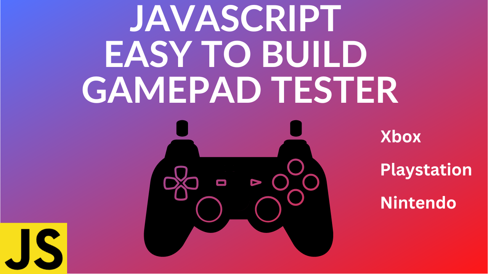

# How to use JS Gamepad API and Build a Gamepad Tester - Just the controller

### Try it here: https://codingwith-adam.github.io/gamepad-tester-simple-just-controller

### YouTube Tutorial: https://youtu.be/UXTOXF8Y2Cs

## Description

An easy to build gamepad tester using the JavaScript Gamepad API. This gamepad tester displays a controller and highlights the buttons being pressed. It can even show the position of the analog sticks in real time.

### Gamepad API

https://developer.mozilla.org/en-US/docs/Web/API/Gamepad_API
